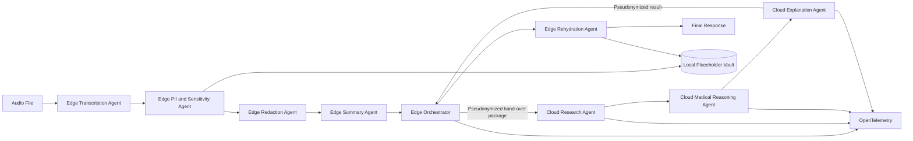
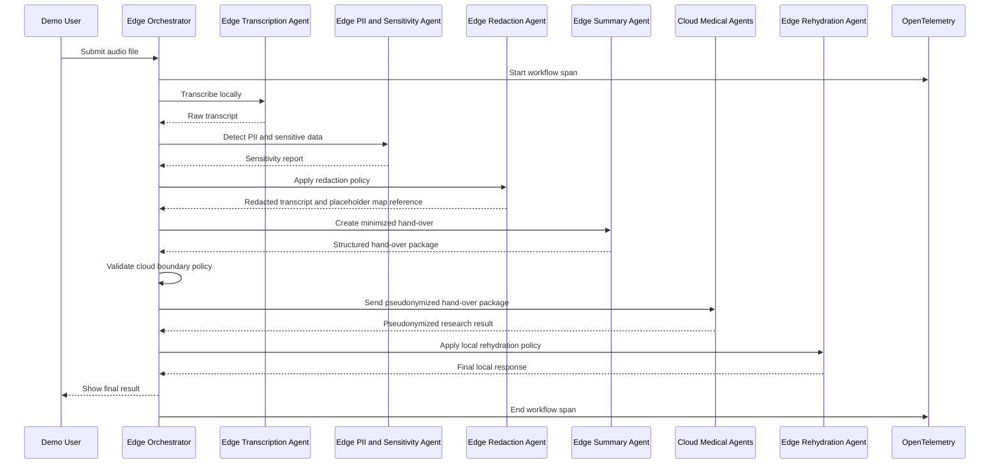

# Hybrid Multi-Agent Architecture

Privacy-preserving medical conversation analysis using purpose-built local and cloud agents.

Sessionize: [https://sessionize.com/app/speaker/session/1187430](https://sessionize.com/app/speaker/session/1187430)

## Talk

**Hybrid Multi Agent Architecture: Combining SLMs on the Edge and LLMs in the Cloud**

This repository contains the demo implementation for a hybrid multi-agent architecture that splits responsibilities between on-premise edge agents and cloud-based reasoning agents.

The core idea is simple:

* **Local agents** run on-premise on OpenShift and handle sensitive data, identity, redaction, pseudonymization, trace context, and controlled rehydration.
* **Local SLMs** are intentionally limited to bounded tasks such as function calling, extraction, summarization, and policy-constrained redaction/transformation.
* **Cloud agents** run in Microsoft Foundry and Azure Red Hat OpenShift and perform the expensive reasoning work, research, ranking, explanation generation, and decision support.
* **Sensitive patient data must not be persisted or reasoned over in the cloud.**
* **The cloud receives only a minimized, pseudonymized hand-over package with derived signals.**

The demo use case is a doctor-patient conversation. An audio recording is transcribed locally, sensitive information is detected and replaced locally, a local SLM creates a privacy-preserving summary, and cloud agents research possible medical conditions based only on the sanitized context. The result is returned to the on-premise environment, where local agents may enrich it again with patient-specific context before presenting it to the healthcare professional.

> This is a technical architecture demo. It is not a medical diagnostic system and must not be used for clinical decision-making without proper validation, regulatory review, and human supervision.

---

## Why This Demo Exists

Most AI demos either send everything to a frontier model or pretend that a small local model can do everything well. Both assumptions are flawed.

This demo takes a stricter position:

* Local models are valuable when the task is narrow, bounded, auditable, and close to sensitive data.
* Frontier models are valuable when the task requires broad reasoning, synthesis, ranking, and explanation.
* The architecture should make that split explicit instead of hiding it behind one generic agent.

The goal is not to build one agent that does everything. The goal is to build a system of purpose-built agents with clear contracts, clear data boundaries, and traceable behavior.

---

## Use Case

A doctor has a conversation with a patient. The conversation is available as an audio file.

The system should:

1. Transcribe the audio file locally.
2. Detect personally identifiable information and sensitive health-related data.
3. Replace sensitive data with stable placeholders.
4. Produce a local, privacy-preserving summary suitable for cloud hand-over.
5. Send only pseudonymized, minimized context to cloud agents.
6. Let cloud agents research possible medical conditions and relevant follow-up questions.
7. Return the cloud result to the on-premise agent.
8. Optionally rehydrate selected placeholders where this is justified for the final user experience.
9. Present the final result to the healthcare professional with traceability and clear caveats.

The important architectural property is that the cloud does not need the patient's identity to do useful reasoning.

---

## Target Scenario

Input:

* Audio file containing a doctor-patient conversation.
* Optional metadata such as recording timestamp, language, tenant, user identity, and consent state.

Output:

* Local transcript.
* Redacted transcript.
* Placeholder mapping stored only on-premise.
* Local summary for cloud hand-over.
* Cloud-generated medical research result.
* Final locally assembled response for the healthcare professional.
* OpenTelemetry trace linking all agent steps without exposing sensitive values.

Sample source material:

* Patientengespräch: [https://www.youtube.com/watch?v=bhEmB1NTUpk](https://www.youtube.com/watch?v=bhEmB1NTUpk)

---

## Key Design Principle

Do not send raw patient data to the cloud.

The architecture uses **pseudonymization**, not true anonymization, because the local system keeps a mapping between placeholders and original values. Under GDPR, this means the information can still be personal data if it can be re-associated with the patient. This distinction matters.

The correct mental model:

* **Raw transcript**: sensitive, on-premise only.
* **Placeholder map**: sensitive, on-premise only.
* **Redacted transcript**: reduced risk, still treated carefully.
* **Derived clinical summary**: minimized cloud hand-over package.
* **Cloud result**: generated from pseudonymized context.
* **Final response**: assembled on-premise, potentially rehydrated only where necessary.

---

## High-Level Architecture



---

## Runtime Split

| Responsibility                | Runtime                                              | Model Type                                     | Data Access                        | Notes                                              |
| ----------------------------- | ---------------------------------------------------- | ---------------------------------------------- | ---------------------------------- | -------------------------------------------------- |
| Audio transcription           | On-premise OpenShift                                 | Local model or local service                   | Raw audio                          | Must stay local for the demo.                      |
| PII detection                 | On-premise OpenShift                                 | SLM                                            | Raw transcript                     | SLM-only extraction; clinical signal preserved. |
| Sensitive data classification | On-premise OpenShift                                 | SLM plus policy engine                         | Raw transcript                     | GDPR-focused classification.                       |
| Placeholder replacement       | On-premise OpenShift                                 | Local SLM-guided replacement and transformation | Raw transcript and placeholder map | Policy-constrained, fail-fast redaction step.      |
| Local summarization           | On-premise OpenShift                                 | SLM                                            | Redacted transcript                | Produces minimized hand-over context.              |
| Medical research              | Cloud, Azure Red Hat OpenShift and Microsoft Foundry | LLM                                            | Pseudonymized summary              | Performs heavy reasoning and retrieval.            |
| Explanation generation        | Cloud, Microsoft Foundry                             | LLM                                            | Pseudonymized result               | Produces structured explanation and caveats.       |
| Rehydration                   | On-premise OpenShift                                 | Deterministic code or SLM-assisted replacement | Placeholder map                    | Only if policy allows it.                          |
| Audit and tracing             | Hybrid                                               | No model required                              | Metadata and derived signals       | Must avoid leaking raw sensitive values.           |

---

## Agent Responsibilities

### 1. Edge Orchestrator Agent

Coordinates the complete workflow.

Responsibilities:

* Accept an audio file or transcript input.
* Create a workflow run ID.
* Enforce data boundary policies.
* Call local agents in the correct order.
* Build the cloud hand-over package.
* Invoke cloud agents only with approved fields.
* Receive cloud results.
* Call local rehydration if needed.
* Emit OpenTelemetry spans for every step.

Must not:

* Send raw transcript to the cloud.
* Send patient name, address, contact details, insurance numbers, exact dates of birth, or other direct identifiers to the cloud.
* Allow agents to bypass the redaction policy.

Suggested implementation:

* Microsoft Agent Framework for orchestration.
* OpenTelemetry instrumentation around each tool call and model invocation.
* Policy validation before every cloud call.

---

### 2. Edge Transcription Agent

Converts the audio file into text.

Responsibilities:

* Accept audio input.
* Transcribe the doctor-patient conversation locally.
* Preserve speaker turns if possible.
* Produce timestamps if available.
* Mark uncertain transcript segments.

Input:

```json
{
  "workflow_id": "wf_123",
  "audio_uri": "file:///data/input/patient-conversation.mp3",
  "language_hint": "de-AT"
}
```

Output:

```json
{
  "workflow_id": "wf_123",
  "transcript_id": "tr_123",
  "language": "de-AT",
  "segments": [
    {
      "speaker": "doctor",
      "start_ms": 1200,
      "end_ms": 5300,
      "text": "Guten Morgen, was führt Sie heute zu mir?",
      "confidence": 0.94
    }
  ]
}
```

Notes:

* For the talk demo, the transcription backend can be swapped.
* The architectural contract is more important than the specific transcription engine.
* Raw audio and raw transcript remain local.

---

### 3. Edge PII and Sensitivity Agent

Detects direct identifiers, quasi-identifiers, sensitive health data, and policy-relevant entities.

Responsibilities:

* Identify PII.
* Identify special category data under GDPR, especially health-related data.
* Classify entities by type and risk level.
* Propose placeholder values.
* Produce a machine-readable sensitivity report.

Example entity types:

* `PERSON_NAME`
* `DATE_OF_BIRTH`
* `AGE`
* `ADDRESS`
* `PHONE_NUMBER`
* `EMAIL`
* `INSURANCE_ID`
* `EMPLOYER`
* `LOCATION`
* `RELATIVE_NAME`
* `MEDICAL_CONDITION`
* `MEDICATION`
* `SYMPTOM`
* `PROCEDURE`
* `TIMESTAMP`
* `FREE_TEXT_IDENTIFIER`

Important distinction:

* Not every medical term should be removed.
* The cloud needs clinically relevant symptoms and findings.
* The local agent should remove identity and unnecessary sensitive context while preserving medically useful derived signals.

Input:

```json
{
  "workflow_id": "wf_123",
  "transcript_id": "tr_123",
  "segments": [
    {
      "speaker": "patient",
      "text": "Ich bin Anna Müller, 42, aus Wien. Ich habe seit drei Tagen Schmerzen in der Brust."
    }
  ]
}
```

Output:

```json
{
  "workflow_id": "wf_123",
  "entities": [
    {
      "type": "PERSON_NAME",
      "value": "Anna Müller",
      "placeholder": "[PATIENT_FIRST_NAME] [PATIENT_LAST_NAME]"
    },
    {
      "type": "AGE",
      "value": "42",
      "placeholder": "[PATIENT_AGE]"
    },
    {
      "type": "SYMPTOM",
      "value": "Schmerzen in der Brust",
      "placeholder": null
    }
  ]
}
```

---

### 4. Edge Redaction Agent

Applies the sensitivity report to create a cloud-safe transcript variant.

Responsibilities:

* Replace direct identifiers with stable placeholders.
* Let the edge SLM perform all configured replacements and generalizations.
* Preserve clinical signal.
* Store placeholder mappings locally.
* Produce a redacted transcript.

Note: transformation decisions (for example age and location generalization)
are executed by the edge SLM in the redaction stage. The policy module enforces
boundary validation and fail-closed cloud gating; it does not do deterministic
text transformation.

Example transformations:

| Original                        | Redacted                            |
| ------------------------------- | ----------------------------------- |
| `Anna Müller`                   | `[PATIENT_FIRST_NAME] [PATIENT_LAST_NAME]` |
| `42 Jahre alt`                  | `adult patient in age bucket 40-49` |
| `Wien, 10. Bezirk`              | `urban area`                        |
| `Sozialversicherungsnummer ...` | `[INSURANCE_ID]`                    |
| `seit 3 Tagen`                  | `duration: 3 days`                  |

Output:

```json
{
  "workflow_id": "wf_123",
  "redacted_transcript_id": "rtr_123",
  "redacted_segments": [
    {
      "speaker": "patient",
      "text": "I am an adult patient in age bucket 40-49 from an urban area. I have had chest pain for 3 days."
    }
  ]
}
```

---

### 5. Edge Summary Agent

Creates a minimized hand-over summary for the cloud agents.

Responsibilities:

* Summarize the redacted transcript.
* Extract clinically relevant facts.
* Remove irrelevant conversational details.
* Preserve uncertainty.
* Produce a structured hand-over package.

The local SLM should not perform diagnosis. It should summarize and structure.

Output:

```json
{
  "workflow_id": "wf_123",
  "handover_package": {
    "patient_context": {
      "age_bucket": "40-49",
      "sex_or_gender": "not provided",
      "region_type": "urban area"
    },
    "chief_complaint": "Chest pain for 3 days",
    "symptoms": [
      {
        "name": "chest pain",
        "duration": "3 days",
        "severity": "not specified",
        "associated_symptoms": []
      }
    ],
    "known_medications": [],
    "known_conditions": [],
    "negative_findings": [],
    "uncertainties": [
      "No vital signs provided",
      "No ECG data provided",
      "No medication history provided"
    ],
    "forbidden_fields_removed": true
  }
}
```

---

### 6. Cloud Research Agent

Researches possible medical conditions, clinical considerations, and follow-up questions using cloud-hosted reasoning and retrieval.

Responsibilities:

* Use the hand-over package as input.
* Query non-sensitive medical reference catalogs using RAG.
* Identify plausible condition categories.
* Produce supporting rationale.
* Highlight red flags.
* Return structured results.

Must not:

* Request patient identity.
* Persist customer state.
* Assume the result is a diagnosis.
* Invent clinical facts not present in the hand-over package.

Output:

```json
{
  "workflow_id": "wf_123",
  "cloud_result": {
    "possible_condition_categories": [
      {
        "category": "urgent cardiovascular causes",
        "examples": ["acute coronary syndrome", "pericarditis"],
        "reasoning": "Chest pain duration and adult age bucket require urgent exclusion of cardiovascular causes.",
        "urgency": "high"
      },
      {
        "category": "gastrointestinal causes",
        "examples": ["reflux", "esophageal spasm"],
        "reasoning": "May be considered depending on pain character and associated symptoms.",
        "urgency": "medium"
      }
    ],
    "recommended_follow_up_questions": [
      "Is the pain pressure-like, stabbing, burning, or movement-related?",
      "Does the pain radiate to arm, jaw, back, or shoulder?",
      "Are there associated symptoms such as shortness of breath, sweating, nausea, or fainting?",
      "Are there known cardiovascular risk factors?"
    ],
    "red_flags": [
      "Chest pain with shortness of breath",
      "Chest pain with sweating or nausea",
      "Chest pain radiating to arm, jaw, back, or shoulder",
      "Syncope or severe weakness"
    ],
    "limitations": [
      "No vital signs available",
      "No physical examination available",
      "No ECG or lab values available"
    ]
  }
}
```

---

### 7. Cloud Explanation Agent

Turns the cloud research result into a clear explanation for a healthcare professional.

Responsibilities:

* Generate a structured explanation.
* Separate evidence from uncertainty.
* Include caveats.
* Avoid diagnostic finality.
* Return only pseudonymized content.

Output:

```json
{
  "workflow_id": "wf_123",
  "explanation": {
    "summary": "The reported symptom pattern requires urgent exclusion of cardiovascular causes before considering lower-risk alternatives.",
    "clinical_reasoning": [
      "Chest pain is a high-priority symptom because potentially serious causes can present with limited initial information.",
      "The available context is insufficient to rank causes reliably without pain character, risk factors, vital signs, ECG, and examination findings."
    ],
    "suggested_next_steps": [
      "Clarify pain character, radiation, triggers, and associated symptoms.",
      "Assess vital signs and cardiovascular risk factors.",
      "Consider urgent evaluation if red flags are present."
    ],
    "safety_note": "This output is decision support only and does not replace clinical judgment."
  }
}
```

---

### 8. Edge Rehydration Agent

Optionally restores selected local context into the final response.

Responsibilities:

* Apply local policy to determine whether rehydration is allowed.
* Replace placeholders only in approved sections.
* Avoid sending rehydrated content back to the cloud.
* Produce the final response for the healthcare professional.

Example:

* `[PATIENT_FIRST_NAME] [PATIENT_LAST_NAME]` may be restored in the final local UI header.
* `[PATIENT_FIRST_NAME] [PATIENT_LAST_NAME]` should not be inserted into the cloud reasoning section unless necessary.
* Exact identifiers such as insurance numbers should usually not be reinserted into generated medical reasoning.

Output:

```json
{
  "workflow_id": "wf_123",
  "final_response": {
    "patient_display_name": "Anna Müller",
    "summary_for_clinician": "The reported symptom pattern requires urgent exclusion of cardiovascular causes before considering lower-risk alternatives.",
    "suggested_questions": [
      "Does the pain radiate to arm, jaw, back, or shoulder?",
      "Are there associated symptoms such as shortness of breath, sweating, nausea, or fainting?"
    ],
    "safety_note": "Decision support only. Not a diagnosis."
  }
}
```

---

## Data Boundary Policy

The policy is the core of the demo. The implementation should fail closed.

### Cloud-Forbidden Data

The following must not be sent to cloud agents:

* Patient name.
* Exact date of birth.
* Exact address.
* Phone number.
* Email address.
* Insurance number.
* Full raw transcript.
* Raw audio.
* Names of relatives unless clinically necessary and approved by policy.
* Employer or workplace if identifying.
* Exact appointment metadata if identifying.
* Any free-text phrase classified as uniquely identifying.

### Cloud-Allowed Data

The following may be sent if required for reasoning and approved by policy:

* Age bucket instead of exact age.
* Generalized region type, for example `urban area` or `rural area`.
* Symptoms.
* Symptom duration.
* Known medications if clinically relevant.
* Known medical history if clinically relevant.
* Negative findings.
* Uncertainties.
* Derived clinical facts.

### Cloud-Allowed With Transformation

These transformations are performed by the edge SLM during redaction.

| Field              | Transformation                          |
| ------------------ | --------------------------------------- |
| Exact age          | Age bucket                              |
| Address            | Region type                             |
| Exact date         | Relative duration                       |
| Occupation         | Risk-relevant category only             |
| Family member name | Relationship only                       |
| Medication brand   | Generic medication class where possible |

---

## Expected Agent Flow



---

## Suggested Repository Structure

```text
.
├── README.md
├── docs/
│   ├── architecture.md
│   ├── data-boundary-policy.md
│   ├── gdpr-notes.md
│   └── demo-script.md
├── agents/
│   ├── edge_orchestrator/
│   ├── transcription_agent/
│   ├── pii_sensitivity_agent/
│   ├── redaction_agent/
│   ├── summary_agent/
│   ├── cloud_research_agent/
│   ├── cloud_explanation_agent/
│   └── rehydration_agent/
├── shared/
│   ├── contracts/
│   │   ├── transcript.schema.json
│   │   ├── sensitivity-report.schema.json
│   │   ├── handover-package.schema.json
│   │   └── cloud-result.schema.json
│   ├── policy/
│   │   ├── cloud-boundary-policy.yaml
│   │   └── rehydration-policy.yaml
│   └── telemetry/
│       └── otel.py
├── deploy/
│   ├── openshift-edge/
│   ├── aro-cloud/
│   └── observability/
├── samples/
│   ├── audio/
│   ├── transcripts/
│   ├── redacted/
│   └── expected-output/
└── tests/
    ├── unit/
    ├── contract/
    ├── policy/
    └── e2e/
```

---

## Implementation Priorities

### Phase 1: Contracts First

Before implementing agents, define and test the data contracts.

Required contracts:

* Transcript schema.
* Sensitivity report schema.
* Redaction manifest schema.
* Hand-over package schema.
* Cloud result schema.
* Final response schema.

The demo should reject invalid payloads early. This is more important than making the agents look intelligent.

### Phase 2: Local Pipeline

Implement the local-only flow:

1. Load sample audio or transcript.
2. Produce transcript.
3. Detect sensitive entities.
4. Apply redaction.
5. Generate local summary.
6. Validate cloud hand-over package.

Success criteria:

* Raw transcript never leaves local runtime.
* Placeholder map is stored locally only.
* Cloud hand-over package passes policy validation.
* Failed policy validation blocks the workflow.

### Phase 3: Cloud Reasoning

Implement cloud agents:

1. Accept only validated hand-over packages.
2. Use RAG over non-sensitive medical reference catalogs.
3. Produce possible condition categories.
4. Produce follow-up questions and safety caveats.
5. Return structured JSON.

Success criteria:

* Cloud agents never receive direct identifiers.
* Cloud responses are structured and machine-validated.
* Reasoning does not invent missing clinical facts.

### Phase 4: Local Rehydration and Final Response

Implement final on-premise assembly:

1. Receive cloud result.
2. Apply rehydration policy.
3. Restore only approved context.
4. Generate final response.
5. Show trace summary.

Success criteria:

* Rehydrated data is never sent back to the cloud.
* Final response clearly separates facts, model-generated reasoning, uncertainty, and safety notes.

---

## Observability

OpenTelemetry is not optional in this demo. It is how the architecture proves the data boundary.

To see hybrid workflow flows in Microsoft Foundry, the backend must export its
OpenTelemetry spans to the same Application Insights resource that is linked to
the Foundry project. In this repo that means setting
`APPLICATIONINSIGHTS_CONNECTION_STRING` before starting the backend.

Important distinction:

* The demo emits custom workflow and stage spans for both local and cloud steps,
  so the full end-to-end flow can be inspected as traces.
* The demo does not create Foundry-managed agent-run records for the local
  stages, because orchestration runs in this app's FastAPI backend rather than
  inside a Foundry-hosted agent runtime.
* If you need every step to appear as a native Foundry agent run, you need to
  move orchestration into a Foundry-hosted agent/service layer and treat the
  local components as external tools invoked from there.

Each agent call should emit spans with:

* Workflow ID.
* Agent name.
* Input classification, not raw input.
* Output classification, not raw output.
* Model name.
* Runtime location, for example `edge` or `cloud`.
* Policy decision.
* Redaction status.
* Cloud eligibility status.
* Error status.

Do not add raw transcript text, patient names, or unredacted payloads to spans.

Example span attributes:

```json
{
  "workflow.id": "wf_123",
  "agent.name": "edge-summary-agent",
  "runtime.location": "edge",
  "input.classification": "redacted_transcript",
  "output.classification": "cloud_handover_package",
  "policy.cloud_allowed": true,
  "pii.direct_identifiers_present": false,
  "model.name": "local-slm-demo"
}
```

---

## Security and Privacy Invariants

These invariants should be enforced by tests.

1. Raw audio is local-only.
2. Raw transcript is local-only.
3. Placeholder mapping is local-only.
4. Direct identifiers are never sent to cloud agents.
5. Cloud hand-over packages are schema-validated.
6. Cloud hand-over packages are policy-validated.
7. Cloud agents are stateless from the application's perspective.
8. Cloud output does not contain newly invented PII.
9. Rehydration happens only on-premise.
10. Rehydrated output is never sent back to the cloud.
11. OpenTelemetry spans contain classifications and decisions, not sensitive values.
12. The final output includes a medical safety disclaimer.

---

## Policy Test Examples

### Should Pass

```json
{
  "patient_context": {
    "age_bucket": "40-49",
    "region_type": "urban area"
  },
  "chief_complaint": "Chest pain for 3 days",
  "symptoms": ["chest pain"],
  "uncertainties": ["No vital signs provided"]
}
```

### Should Fail

```json
{
  "patient_context": {
    "name": "Anna Müller",
    "date_of_birth": "1983-04-18",
    "address": "Example Street 12, Vienna"
  },
  "chief_complaint": "Chest pain for 3 days"
}
```

Failure reason:

```json
{
  "cloud_allowed": false,
  "violations": [
    "Direct identifier present: patient_context.name",
    "Direct identifier present: patient_context.date_of_birth",
    "Direct identifier present: patient_context.address"
  ]
}
```

---

## Demo Narrative

The demo should make the architecture visible.

Recommended demo flow:

1. Show the raw doctor-patient transcript locally.
2. Run the sensitivity agent and show detected entities.
3. Show the redacted transcript.
4. Show the minimized hand-over package.
5. Show the policy gate before the cloud call.
6. Invoke the cloud medical research agents.
7. Show the cloud result.
8. Show local rehydration.
9. Show the final clinician-facing result.
10. Show the trace proving which data crossed which boundary.

The strongest demo moment is not the medical reasoning. The strongest demo moment is proving that the cloud model was useful without receiving the patient's identity.

---

## Technology Stack

Planned technologies:

* **OpenShift** for on-premise edge runtime.
* **Azure Red Hat OpenShift** for cloud-side agent runtime.
* **Microsoft Agent Framework** for agent orchestration.
* **Microsoft Foundry** for cloud model and agent integration.
* **Foundry Local SDK** for local model integration where applicable.
* **OpenTelemetry** for end-to-end tracing.
* **RAG over non-sensitive catalogs** for cloud-side medical research.

Optional components:

* **MicroShift** for a smaller edge runtime variant.
* **Policy engine** for explicit data boundary enforcement.
* **Vector database** for non-sensitive reference material.

---

## Model Usage Strategy

This demo intentionally avoids the pattern where every task is sent to the most capable model.

### Local SLMs Should Do

* Function calling.
* Entity extraction.
* Summarization.
* Classification against a narrow policy.
* Text replacement suggestions.
* Structured output generation.

### Local SLMs Should Not Do

* Deep medical reasoning.
* Broad differential diagnosis.
* Long-horizon planning.
* Complex ranking across medical evidence.
* Final clinical recommendation generation.

### Cloud LLMs Should Do

* Research over non-sensitive catalogs.
* Reasoning across symptoms and context.
* Ranking of possible condition categories.
* Explanation generation.
* Follow-up question generation.
* Uncertainty analysis.

### Cloud LLMs Should Not Do

* Identity handling.
* Raw transcript processing.
* Placeholder rehydration.
* Sensitive state persistence.
* Long-term patient memory.

---

## Development Guidelines for Coding Agents

Coding agents implementing this repository should follow these rules:

1. Start with schemas and tests before agent logic.
2. Treat every boundary crossing as a policy decision.
3. Never pass raw transcript text to cloud-side code.
4. Add explicit tests for forbidden fields.
5. Make all agent input and output payloads JSON-serializable.
6. Prefer small, composable agents over one large agent.
7. Keep prompts versioned in the repository.
8. Keep policies versioned in the repository.
9. Emit OpenTelemetry spans for every agent call.
10. Do not log raw patient data.
11. Do not store placeholder maps outside the edge runtime.
12. Fail closed on schema or policy errors.

---

## Non-Goals

This demo does not aim to:

* Build a certified medical device.
* Replace clinicians.
* Produce a definitive diagnosis.
* Prove that pseudonymized data is anonymous.
* Store longitudinal patient records in the cloud.
* Optimize for the fewest number of agents.
* Hide complexity behind a single generic chatbot.

---

## Open Questions

The implementation should make these decisions explicit:

* Which local transcription model or service should be used?
* Which local SLM should be used for extraction and summarization?
* Which policy engine should enforce the cloud boundary?
* Which medical reference catalogs are acceptable for the RAG corpus?
* How should consent and tenant context be represented?
* How much rehydration is appropriate in the final response?
* What information should be shown in the demo UI versus the trace view?

---

## Minimal End-to-End Success Criteria

The demo is successful when it can show this complete flow:

1. A doctor-patient audio file is processed locally.
2. A transcript is generated locally.
3. PII and sensitive fields are detected.
4. A redacted transcript is created.
5. A cloud-safe hand-over summary is generated.
6. A policy gate blocks unsafe payloads and permits safe payloads.
7. Cloud agents generate useful medical research from pseudonymized data.
8. The result returns to the on-premise system.
9. The final response is assembled locally.
10. The trace shows what happened without leaking raw sensitive values.

If the demo proves that split convincingly, the architecture message lands.

---

## Appendix: Running the Demo

This appendix documents the as-built implementation that lives under
`src/hybrid_demo/`, `web/`, `gitops/`, and `docker/`.

### 1. Repository layout

```
src/hybrid_demo/         # Python package (agents, workflow, AG-UI server)
  edge/                  # transcription, pii, redaction, summary, rehydration
  cloud/                 # research, explanation
  contracts.py           # Pydantic v2 contracts for every payload
  policy.py              # Single source of truth for the cloud-handover gate
  vault.py               # In-memory placeholder vault, edge-only by ContextVar
  workflow.py            # Async orchestration, emits stage.* events
  ag_ui_server.py        # FastAPI + SSE + AG-UI envelope
web/                     # Next.js 14 + CopilotKit + AG-UI client
docker/                  # Multi-stage Dockerfiles (backend, web)
gitops/                  # Argo CD app-of-apps + MicroShift overlay
.github/workflows/       # CI, GHCR builds, GitOps tag bump
models.yaml              # Central model registry (override via env)
samples/transcripts/     # Example transcripts for development/testing
tests/                   # Policy, redaction, config, end-to-end invariants
scripts/                 # fetch_sample_audio.py, run_demo.sh
```

### 2. Version and Dependencies

| Component              | Version | Required | Notes                                                  |
|------------------------|---------|----------|--------------------------------------------------------|
| Agent Framework Core   | 1.7.0   | Yes      | Primary orchestration and async boundary              |
| Agent Framework Foundry | 1.7.0  | Yes      | Cloud (Foundry/openai-compatible) integration          |
| Foundry Local SDK      | ≥0.5.1  | Optional | Enables edge.slm.provider=foundry-local (in-container) |
| Agent Framework Foundry Local | 1.0.0b260521+ | Optional | Python SDK wrapper for Foundry Local via Agent Framework |
| Faster Whisper         | ≥1.0.0  | Optional | Edge audio transcription (edge.transcription provider)  |
| FastAPI                | ≥0.115  | Yes      | Backend HTTP server (SSE + /run endpoint)              |
| Azure Identity         | ≥1.18   | Yes      | Workload identity for cloud Foundry agents             |
| Azure Monitor OTel     | ≥1.6.0  | Yes      | Application Insights telemetry export                  |
| Pydantic               | ≥2.7    | Yes      | Data contract validation (PII, redaction, handover)    |

#### Edge SLM Provider Options

**Option 1: foundry-local (in-container)**

Requires Foundry Local runtime installed and running in the container. Best for production edge runtimes with dedicated Foundry deployment.

```yaml
# models.yaml
edge:
  slm:
    provider: foundry-local
    model: phi-4-mini
```

**Option 2: openai-compatible (remote endpoint)**

Points to a remote OpenAI-compatible endpoint. Useful for dev/test or when Foundry Local is unavailable in the container (e.g., running on host).

```yaml
# models.yaml
edge:
  slm:
    provider: openai-compatible
    base_url: http://host.docker.internal:57280/v1  # or your endpoint
    model: phi-4-mini
```

On Docker Desktop, use `host.docker.internal` to reach host services. To find your Foundry service port:

```powershell
# On host PowerShell where Foundry is running
foundry service status  # Shows http://127.0.0.1:<PORT>/

# Update models.yaml base_url to match the port
```

### 3. Configure models

All model identifiers live in `models.yaml` and can be overridden via env vars
that follow the pattern `HYBRID_DEMO__<section>__<role>__<field>`.

```bash
# Example: temporarily switch the SLM to the reasoning variant
export HYBRID_DEMO__EDGE__SLM__MODEL=phi-4-reasoning
```

### 4. Local prerequisites

```bash
# Python
python3.12 -m venv .venv && source .venv/bin/activate
pip install -e ".[local,dev]"

# Foundry Local (host) — pull the SLM and ASR models referenced in models.yaml
foundry model download whisper-large-v3-turbo
foundry model download phi-4
foundry service start

# Cloud auth for the Foundry-hosted GPT-class agents
az login
export FOUNDRY_PROJECT_ENDPOINT="https://<your-foundry-project>.services.ai.azure.com"

# Optional: ship traces to Application Insights
export APPLICATIONINSIGHTS_CONNECTION_STRING="InstrumentationKey=...;..."
```

### 5. Run the demo

```bash
hybrid-demo-server              # http://localhost:8000
cd web && npm install && npm run dev   # http://localhost:3000
# or one command:
./scripts/run_demo.sh
```

The UI streams `stage.*` events via Server-Sent Events under an AG-UI
`run.started` / `run.finished` envelope and renders one panel per stage with
edge / cloud / gate runtime badges.

The backend is fail-fast: an audio file is required for each run and model/
cloud failures are surfaced as errors (no runtime fallback responses).

### 6. Tests

```bash
pytest -q
```

The suite covers:

- `tests/test_policy.py` — the README "Should Pass" / "Should Fail" handovers
  produce the exact expected violation strings.
- `tests/test_redaction.py` — redaction is SLM-driven and verifies configured
  replacements/generalizations while preserving clinical signal.
- `tests/test_invariants.py` — fail-fast workflow invariants and cloud-boundary
  guard behavior (no runtime fallbacks).
- `tests/test_config.py` — env overrides flip the resolved model name.
- `tests/test_redaction_integration.py` — opt-in live integration checks that
  execute SLM-driven redaction on dummy transcripts.

Run live SLM integration tests explicitly:

```bash
RUN_SLM_INTEGRATION=1 pytest -q tests/test_redaction_integration.py
```

### 7. Container images

Multi-arch images are pushed to GHCR by `.github/workflows/build-backend.yaml`
and `build-web.yaml`. After each successful build, `gitops-bump.yaml` opens a
PR updating `gitops/overlays/microshift-edge/kustomization.yaml` with the new
SHA-tagged image. Merging the PR triggers Argo CD to roll out the change.

```
ghcr.io/<owner>/hybrid-multi-agents/backend:sha-<commit>
ghcr.io/<owner>/hybrid-multi-agents/web:sha-<commit>
```

Override the namespace via the `IMAGE_NAMESPACE` repo variable.

### 8. Deploy on MicroShift via Argo CD

Foundry Local stays on the host and is exposed to the cluster via an
`ExternalName` Service pointing at `host.containers.internal:5273`.

```bash
# Bootstrap Argo CD app-of-apps
oc apply -f gitops/argocd/projects/hybrid-demo.yaml
oc apply -f gitops/argocd/app-of-apps.yaml
```

Sync waves drive ordering:

| Wave | Application                |
|-----:|----------------------------|
|  -1  | hybrid-demo-project        |
|   0  | hybrid-demo-foundry-local  |
|   0  | hybrid-demo-otel           |
|   1  | hybrid-demo-backend (web + backend overlay) |

Routes are TLS-edge by default. Telemetry flows backend → OTel Collector →
Application Insights via the `azuremonitor` exporter.

### 9. The "story" stages emitted on the wire

```
stage.transcript     edge  whisper-large-v3-turbo (Foundry Local)
stage.entities       edge  phi-4, SLM-only extraction, clinical signal preserved
stage.redacted       edge  SLM-driven redaction/transformation + vault.store() for direct identifiers
stage.handover       edge  phi-4, strict JSON HandoverPackage
stage.policy_gate    gate  Pure Python, fails closed
stage.blocked        gate  (only when the gate denies)
stage.research       cloud gpt-5.4-mini-1 via FoundryChatClient + AzureCliCredential
stage.explanation    cloud gpt-5.4-mini-1, patient-friendly rewrite
stage.final          edge  Vault rehydrates [PATIENT_FIRST_NAME] [PATIENT_LAST_NAME] for display only
```

Anything emitted under `stage.research`, `stage.explanation`, or `stage.final`
is provably free of direct identifiers — that is the property the policy gate
enforces and that `tests/test_invariants.py` re-asserts on every commit.
